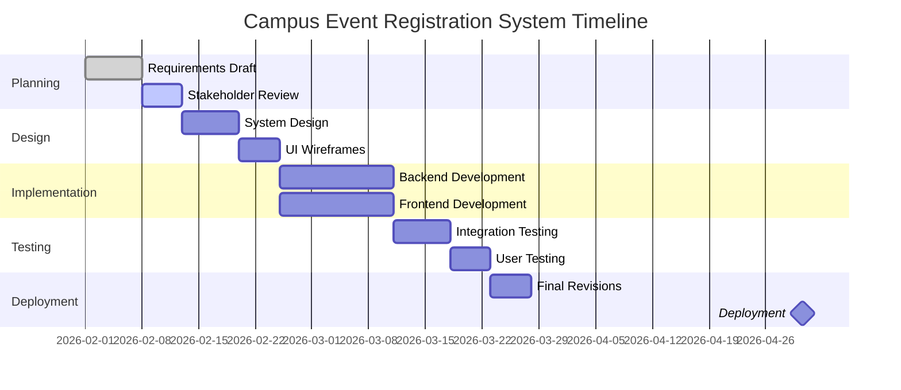

# Campus Event Registration System

**Course:** CS375  
**Team:** Example Team  
**Version:** v0.3  
**Last Updated:** February 19, 2026

---

# 1. Overview

## 1.1 Purpose

** Please Note -- This is NOT intended to be a full example but rather the rough format for the submission. Please refer to the assignment and rubric for the actual requirements for this assignment **

The Campus Event Registration System (CERS) is a web-based application that allows students to browse, register for, and manage campus events. Event organizers can create events and track attendance.

The goal of this system is to simplify event coordination and improve campus engagement.

---

# 2. Stakeholders

| Stakeholder               | Role            | Goals                                   |
| ------------------------- | --------------- | --------------------------------------- |
| Students                  | Event attendees | Discover and register for events        |
| Event Organizers          | Faculty / clubs | Create events and manage attendance     |
| Student Activities Office | Oversight       | Ensure compliance and visibility        |
| Development Team          | Builders        | Deliver reliable, maintainable software |

---

# 3. Functional Requirements

## 3.1 Event Discovery

### FR-1: Browse Events

- Users shall view upcoming events.
- Events shall display title, date, time, location, and capacity.

### FR-2: Filter Events

Users shall filter events by:

- Date
- Category
- Organization

---

## 3.2 Registration

### FR-3: Register for Event

- Authenticated users shall register for events.
- Users shall not register for full events.
- Registration confirmation shall be displayed.

### FR-4: Cancel Registration

- Users shall cancel registration before event start time.
- Canceling shall increase available seats.

---

## 3.3 Event Management

### FR-5: Create Event

Organizers shall create events with:

- Title
- Description
- Date/time
- Location
- Capacity
- Category

### FR-6: Edit Event

Organizers shall edit event details before the start time.

### FR-7: View Attendance

Organizers shall view registered attendees.

---

# 4. Non-Functional Requirements

## 4.1 Performance

- Event list loads in under 2 seconds.
- Supports 500 concurrent users.

## 4.2 Security

- University authentication required.
- Users modify only their own registrations.
- Organizers modify only their own events.

## 4.3 Usability

- Mobile responsive.
- Registration in ≤3 clicks from event list.

## 4.4 Reliability

- 99% uptime during semester.
- Persistent data storage.

---

# 5. User Stories

### Student Stories

- As a student, I want to browse events so that I can find activities.
- As a student, I want to register for an event so that I can reserve a seat.
- As a student, I want to cancel registration so I can free my spot.

### Organizer Stories

- As an organizer, I want to create events so students can attend.
- As an organizer, I want to see who registered so I can plan.

---

# 6. Acceptance Criteria Example

## Story: Register for Event

**Given** a logged-in student  
**And** seats are available  
**When** the student clicks “Register”  
**Then** they are added to the attendee list  
**And** available seats decrease by one  
**And** confirmation is shown

---

# 7. Project Timeline (Gantt Chart)

The following Gantt chart outlines the projected development schedule for the semester.

